# PROPOSAL CAPSTONE PROJECT
## Sistem Peringatan Dini Potensi Titik Banjir Berdasarkan Durasi dan Curah Hujan Menggunakan Algoritma K-Nearest Neighbor (K-NN)

<div style="text-align: center; margin-top: 30px; margin-bottom: 30px;">
  <p><strong>Oleh:</strong></p>
  <p><strong>Rivelino Wahyu Rizky</strong><br>NIM. 2311081035</p>
  <br>
  <p><strong>PROGRAM STUDI TEKNOLOGI REKAYASA PERANGKAT LUNAK</strong><br>
  <strong>JURUSAN TEKNOLOGI INFORMASI</strong><br>
  <strong>POLITEKNIK NEGERI PADANG</strong><br>
  <strong>2026</strong></p>
</div>

---

### ABSTRAK

Banjir genangan akibat tingginya curah hujan merupakan salah satu permasalahan lingkungan yang sering terjadi dan berdampak pada terganggunya mobilitas serta aktivitas masyarakat. Informasi peringatan dini yang beredar saat ini masih bersifat makro dan belum dapat diakses secara *real-time* dan personal oleh masyarakat umum di lokasi spesifik mereka. Oleh karena itu, diperlukan suatu sistem yang dapat membantu memprediksi potensi genangan air secara cepat dan efisien agar mitigasi dapat dilakukan lebih awal.

Penelitian ini bertujuan untuk merancang dan membangun sistem peringatan dini potensi banjir genangan berbasis *mobile* dengan menggunakan algoritma *K-Nearest Neighbor* (K-NN). Data yang digunakan berupa data historis cuaca yang meliputi intensitas curah hujan (mm) dan durasi hujan berlangsung (jam), serta label status genangan air pada suatu wilayah yang diperoleh dari Kaggle dan BMKG.

Metode *K-Nearest Neighbor* digunakan untuk menentukan tingkat kemiripan antara kondisi cuaca saat ini yang diinputkan pengguna dengan data historis cuaca di masa lalu untuk menghasilkan klasifikasi status "Aman" atau "Waspada Banjir". Hasil yang diharapkan dari penelitian ini adalah terciptanya sistem yang mampu memberikan informasi potensi banjir genangan secara cepat, akurat, dan mudah diakses sehingga dapat mendukung upaya mitigasi bencana bagi masyarakat dan instansi terkait.

**Kata Kunci:** *Sistem Peringatan Dini, Banjir Genangan, K-Nearest Neighbor, Machine Learning, Mobile Application*

---

### DAFTAR ISI

- [BAB I: PENDAHULUAN](#bab-i-pendahuluan)
  - [1.1 Latar Belakang](#11-latar-belakang)
  - [1.2 Rumusan Masalah](#12-rumusan-masalah)
  - [1.3 Tujuan Penelitian](#13-tujuan-penelitian)
  - [1.4 Batasan Masalah](#14-batasan-masalah)
- [BAB II: TINJAUAN PUSTAKA](#bab-ii-tinjauan-pustaka)
  - [2.1 Penelitian Terkait](#21-penelitian-terkait)
  - [2.2 Sistem Peringatan Dini (Early Warning System)](#22-sistem-peringatan-dini-early-warning-system)
  - [2.3 Algoritma K-Nearest Neighbor (K-NN)](#23-algoritma-k-nearest-neighbor-k-nn)
  - [2.4 Konsep Curah Hujan dan Banjir Genangan](#24-konsep-curah-hujan-dan-banjir-genangan)
  - [2.5 Library yang Digunakan pada Model](#25-library-yang-digunakan-pada-model)
  - [2.6 Tools yang Digunakan](#26-tools-yang-digunakan)
  - [2.7 Database yang Digunakan](#27-database-yang-digunakan)
  - [2.8 Mobile Application Development (Flutter)](#28-mobile-application-development-flutter)
- [BAB III: METODOLOGI](#bab-iii-metodologi)
  - [3.1 Deskripsi Solusi](#31-deskripsi-solusi)
  - [3.2 Analisis Kebutuhan](#32-analisis-kebutuhan)
  - [3.3 Analisis Algoritma K-Nearest Neighbor](#33-analisis-algoritma-k-nearest-neighbor)
  - [3.4 Perancangan Sistem](#34-perancangan-sistem)
  - [3.5 Desain Fisik Database](#35-desain-fisik-database)
  - [3.6 Desain Antarmuka Pengguna (UI)](#36-desain-antarmuka-pengguna-ui)
- [BAB IV: IMPLEMENTASI DAN PENGUJIAN](#bab-iv-implementasi-dan-pengujian)
  - [4.1 Implementasi](#41-implementasi)
  - [4.2 Analisa Algoritma K-NN](#42-analisa-algoritma-k-nn)
  - [4.3 Pengujian Sistem dan Evaluasi](#43-pengujian-sistem-dan-evaluasi)
- [BAB V: KESIMPULAN DAN SARAN](#bab-v-kesimpulan-dan-saran)
  - [5.1 Kesimpulan](#51-kesimpulan)
  - [5.2 Saran](#52-saran)
- [BAB VI: JADWAL PELAKSANAAN](#bab-vi-jadwal-pelaksanaan)
- [DAFTAR PUSTAKA](#daftar-pustaka)


---

## BAB I: PENDAHULUAN

### 1.1 Latar Belakang
Perubahan cuaca yang ekstrem sering kali menyebabkan tingginya intensitas curah hujan di berbagai wilayah, termasuk di daerah perkotaan. Curah hujan yang tinggi dengan durasi yang lama, ditambah dengan kondisi drainase yang kurang optimal, sering kali memicu terjadinya banjir genangan. Bencana ini tidak hanya menghambat aktivitas sosial dan ekonomi masyarakat, tetapi juga dapat menimbulkan kerugian material jika tidak diantisipasi sejak dini. Oleh karena itu, ketersediaan informasi peringatan dini potensi banjir menjadi hal yang sangat krusial bagi masyarakat.

Saat ini, informasi mengenai cuaca dan potensi bencana umumnya masih bersifat makro dan disiarkan melalui portal resmi pemerintah seperti BMKG. Namun, dalam pelaksanaannya di lapangan, masih terdapat kendala di mana masyarakat membutuhkan peringatan dini yang lebih personal, cepat diakses, dan spesifik untuk wilayah mereka saat hujan lebat sedang berlangsung.

Perkembangan teknologi, khususnya dalam bidang *machine learning*, memungkinkan pengembangan sistem prediksi cerdas yang dapat membantu dalam pengambilan keputusan mitigasi secara otomatis. Algoritma *K-Nearest Neighbor* (K-NN) dapat digunakan untuk menemukan kemiripan pola kondisi cuaca saat ini dengan kejadian banjir di masa lalu berdasarkan parameter curah hujan dan durasi.

Berdasarkan permasalahan tersebut, penelitian ini bertujuan untuk membangun sistem peringatan dini potensi banjir genangan berbasis *mobile* yang mampu memberikan notifikasi bahaya secara *real-time* menggunakan algoritma *K-Nearest Neighbor*, sehingga masyarakat dapat melakukan tindakan pencegahan secara lebih tanggap.

### 1.2 Rumusan Masalah
Berdasarkan latar belakang yang telah diuraikan, maka rumusan masalah dalam penelitian ini adalah sebagai berikut:
1. Bagaimana merancang antarmuka sistem peringatan dini potensi banjir genangan berbasis *mobile*?
2. Bagaimana menerapkan algoritma *K-Nearest Neighbor* dalam memproses data durasi dan curah hujan untuk mengklasifikasikan status banjir?
3. Bagaimana menghasilkan informasi dan peringatan yang akurat bagi masyarakat pengguna aplikasi?
4. Bagaimana mengintegrasikan logika algoritma K-NN di sisi backend dengan aplikasi mobile (frontend) melalui layanan API agar menghasilkan prediksi secara *real-time*?
5. Bagaimana menguji dan mengukur tingkat akurasi prediksi dari algoritma K-NN pada sistem peringatan dini yang telah dibangun?

### 1.3 Tujuan Penelitian
1. Merancang dan membangun aplikasi mobile peringatan dini potensi banjir genangan.
2. Mengimplementasikan algoritma *K-Nearest Neighbor* (K-NN) untuk memprediksi status bahaya genangan berdasarkan input kondisi cuaca pengguna.
3. Menghasilkan sistem yang dapat membantu masyarakat dalam mitigasi bencana secara praktis melalui *smartphone*.
4. Mengintegrasikan model K-NN dengan backend API Flask dan frontend Flutter agar sistem bekerja secara *real-time*.
5. Mengukur dan melaporkan tingkat akurasi sistem melalui pengujian menggunakan data uji terpisah.

### 1.4 Batasan Masalah
1. Parameter input utama yang digunakan untuk prediksi adalah intensitas curah hujan (mm) dan durasi hujan berlangsung (jam).
2. Dataset historis yang digunakan diperoleh dari portal data publik Kaggle dan BMKG (atau data sintetik berbasis distribusi nyata).
3. Algoritma klasifikasi yang digunakan secara eksklusif dalam sistem adalah *K-Nearest Neighbor* (K-NN).
4. Output sistem berupa klasifikasi status "Aman" atau "Waspada Banjir" (Rendah, Sedang, Tinggi, Sangat Tinggi) yang ditampilkan pada layar aplikasi mobile.
5. Sistem dikembangkan dalam bentuk aplikasi mobile menggunakan framework Flutter yang terhubung ke layanan API backend berbasis Flask/Python.
6. Sistem tidak mencakup prediksi banjir besar (bandang) dan tidak terhubung ke sensor fisik secara langsung.

---

## BAB II: TINJAUAN PUSTAKA

### 2.1 Penelitian Terkait
Penelitian terkait digunakan sebagai dasar dalam pengembangan sistem peringatan dini pada penelitian ini. Beberapa penelitian yang relevan adalah sebagai berikut:
- Penelitian mengenai **"Klasifikasi Daerah Rawan Banjir menggunakan 10-Fold Cross Validation dan K-Nearest Neighbors" (2023)** menunjukkan bahwa algoritma K-NN sangat andal dalam memproses data lingkungan untuk memprediksi wilayah terprediksi banjir dengan tingkat akurasi mencapai 85%.
- Penelitian lain berjudul **"Implementasi Metode K-Nearest Neighbour Dalam Memprediksi Curah Hujan" (2022)** menjelaskan bahwa parameter cuaca dari BMKG sangat efektif diolah menjadi angka numerik yang dapat dihitung oleh K-NN untuk menghasilkan prediksi berbasis cuaca.
- Penelitian **"Sistem dan Simulasi Deteksi Banjir Untuk Peringatan Dini Diolah Memakai Metode KNN" (2020)** mengonfirmasi bahwa kecerdasan buatan dapat menerima input angka lingkungan untuk memicu status keamanan. Penelitian ini membawa kebaruan dengan menggeser pendekatan berbasis *hardware* lokal menjadi solusi *software* berbasis *mobile* yang dapat dijangkau masyarakat luas.

### 2.2 Sistem Peringatan Dini (Early Warning System)
Sistem peringatan dini adalah suatu rangkaian proses yang dirancang untuk mendeteksi, menganalisis, dan menyampaikan informasi tentang ancaman bencana kepada masyarakat sebelum dampak buruk terjadi. Menurut Coppola (2011) dalam buku *"Introduction to International Disaster Management"*, sistem peringatan dini yang efektif terdiri dari empat komponen utama: pengetahuan tentang risiko, pemantauan dan peringatan, penyebaran dan komunikasi, serta kapasitas respons.

Dalam konteks penelitian ini, sistem peringatan dini dibangun berbasis *mobile* dengan memanfaatkan algoritma K-NN untuk komponen pemantauan dan peringatan. Pengguna berperan sebagai sensor manusia yang memasukkan data kondisi cuaca di lokasi mereka secara *real-time*.

### 2.3 Algoritma K-Nearest Neighbor (K-NN)
*K-Nearest Neighbor* (K-NN) merupakan salah satu algoritma *supervised learning* dalam *machine learning* yang bekerja berdasarkan prinsip kedekatan (*similarity*) antar data. Menurut Han, Kamber, dan Pei (2012) dalam buku *"Data Mining: Concepts and Techniques" (Third Edition)*, K-NN mengklasifikasikan data baru berdasarkan mayoritas kelas dari K data tetangga terdekat yang dihitung menggunakan fungsi jarak.

Algoritma K-NN bekerja dengan langkah-langkah berikut:
1. Menentukan nilai K (jumlah tetangga terdekat yang akan dipertimbangkan).
2. Menghitung jarak antara data uji dengan seluruh data training menggunakan *Euclidean Distance*.
3. Mengurutkan hasil perhitungan jarak dari yang terkecil ke terbesar.
4. Mengambil K data training dengan jarak terkecil sebagai tetangga terdekat.
5. Menentukan kelas berdasarkan voting mayoritas dari K tetangga tersebut.

Rumus *Euclidean Distance* yang digunakan adalah:

$$d(x, y) = \sqrt{\sum_{i=1}^{n} (x_i - y_i)^2}$$

Di mana $x$ adalah vektor fitur data uji (curah hujan & durasi dari pengguna), $y$ adalah vektor fitur data training (data historis), dan $d$ adalah jarak Euclidean antara keduanya.

Menurut Mitchell (1997) dalam buku *"Machine Learning"*, K-NN termasuk dalam kategori *lazy learning* karena tidak membangun model eksplisit selama fase pelatihan, melainkan menyimpan seluruh dataset dan melakukan perhitungan saat prediksi diperlukan. Kelebihan ini membuat K-NN sangat mudah diimplementasikan dan diperbarui datanya.

### 2.4 Konsep Curah Hujan dan Banjir Genangan
Curah hujan adalah jumlah air yang jatuh di permukaan tanah datar selama periode tertentu yang diukur dengan satuan tinggi (milimeter/mm). Menurut Tjasyono (2004) dalam buku *"Klimatologi"*, curah hujan diklasifikasikan berdasarkan intensitasnya:
* Hujan sangat ringan: $<5$ mm/jam
* Hujan ringan: $5 - 20$ mm/jam
* Hujan sedang: $20 - 50$ mm/jam
* Hujan lebat: $50 - 100$ mm/jam
* Hujan sangat lebat: $>100$ mm/jam

Kombinasi antara intensitas curah hujan yang tinggi dan durasi hujan yang panjang merupakan faktor utama pemicu ketidakmampuannya saluran drainase dalam menampung debit air, yang berujung pada terjadinya genangan di permukaan. Parameter inilah yang dijadikan *baseline* (fitur) bagi algoritma K-NN untuk memetakan potensi bencana genangan.

Menurut Suripin (2004) dalam buku *"Sistem Drainase Perkotaan yang Berkelanjutan"*, kapasitas drainase perkotaan umumnya dirancang untuk menampung hujan dengan periode ulang 2-5 tahun. Bila intensitas hujan melampaui kapasitas tersebut, genangan dipastikan terjadi dalam durasi yang bervariasi bergantung pada kondisi topografi dan sistem saluran.

### 2.5 Library yang Digunakan pada Model
Dalam pengembangan model *machine learning* K-NN pada sistem ini, beberapa library Python digunakan sebagai berikut:

#### Tabel 2.1 Library Python yang Digunakan pada Model
| Library | Versi | Fungsi dalam Sistem |
|---|---|---|
| **scikit-learn** | $\ge 1.3$ | Menyediakan implementasi algoritma K-NN (`KNeighborsClassifier`) yang digunakan sebagai pembanding/validasi keakuratan model. Serta fungsi evaluasi model (`train_test_split`, `confusion_matrix`, `accuracy_score`). |
| **pandas** | $\ge 2.0$ | Digunakan untuk membaca, membersihkan, dan memanipulasi dataset cuaca historis (CSV) ke format DataFrame sebelum diproses. |
| **numpy** | $\ge 1.24$ | Mendukung komputasi numerik cepat, seperti perhitungan jarak Euclidean dan manipulasi matriks/vektor. |
| **Flask** | $\ge 3.0$ | Framework web utama untuk backend API RESTful yang menerima request dari aplikasi mobile dan mengembalikan prediksi JSON. |
| **joblib** | $\ge 1.3$ | Digunakan untuk melakukan serialisasi (`.pkl`) model guna pengujian terpisah. |
| **matplotlib / seaborn** | $\ge 3.7$ | Digunakan untuk visualisasi visual sebaran data cuaca historis selama fase analisis data. |

### 2.6 Tools yang Digunakan
Berikut adalah perangkat lunak (*tools*) yang digunakan dalam keseluruhan pengembangan sistem:

#### Tabel 2.2 Tools yang Digunakan dalam Pengembangan Sistem
| Tools | Versi | Fungsi |
|---|---|---|
| **Flutter** | $\ge 3.19$ | Framework utama pengembangan aplikasi mobile lintas platform (Android & iOS) untuk antarmuka pengguna. |
| **Dart** | $\ge 3.3$ | Bahasa pemrograman untuk membangun logika client-side pada aplikasi mobile. |
| **Python** | $\ge 3.10$ | Bahasa pemrograman utama di sisi backend untuk pengolahan K-NN murni. |
| **VS Code** | Latest | *Integrated Development Environment* (IDE) untuk menulis kode Dart dan Python. |
| **Jupyter Notebook**| Latest | Lingkungan interaktif untuk pembersihan data awal dan pengujian formula. |
| **Thunder Client** | Latest | Ekstensi VS Code untuk pengujian endpoint REST API secara lokal. |
| **MySQL** | $8.x$ | Sistem Database Relasional di sisi server untuk menyimpan data latih, data pengguna, dan log riwayat. |
| **SQLite** | $3.x$ | Database lokal pada handphone melalui paket `sqflite` Flutter untuk caching data. |
| **Git / GitHub** | Latest | Sistem pengontrol versi untuk melacak perubahan kode program secara kolaboratif. |

### 2.7 Database yang Digunakan
Sistem ini menggunakan dua jenis database sesuai dengan perannya masing-masing:

#### 2.7.1 MySQL (Relational Database Management System)
MySQL digunakan di sisi server (backend) untuk penyimpanan jangka panjang. Menurut Welling dan Thomson (2016) dalam buku *"PHP and MySQL Web Development" (Edisi 5)*, MySQL mengorganisir data dalam bentuk tabel dua dimensi yang saling berelasi melalui *primary key* dan *foreign key*.

#### Tabel 2.3 Spesifikasi MySQL dalam Sistem
| Aspek | Keterangan |
|---|---|
| **Tipe Database** | Relational Database Management System (RDBMS) |
| **Bahasa Query** | SQL (Structured Query Language) |
| **Port Default** | 3306 |
| **Penyimpanan** | Server terpisah (*standalone server process*) |
| **Library Penghubung** | `pymysql` (di Flask) |
| **Penggunaan** | Penyimpanan dataset latih terpusat, data login pengguna, dan log histori lengkap |
| **Tipe Data Didukung**| INT, VARCHAR, TEXT, DOUBLE, TIMESTAMP, TINYINT |

#### 2.7.2 SQLite (Embedded Database)
SQLite adalah database lokal yang bersifat *serverless* dan *zero-configuration*. Menurut Owens dan Allen (2010) dalam *"The Definitive Guide to SQLite" (Edisi 2)*, SQLite menyimpan seluruh data dalam satu berkas tunggal `.db` di memori perangkat, sehingga tidak memerlukan proses server terpisah.

#### Tabel 2.4 Perbandingan MySQL dan SQLite dalam Sistem
| Aspek | MySQL | SQLite |
|---|---|---|
| **Tipe** | RDBMS (Server-based) | RDBMS (Embedded/Serverless) |
| **Bahasa Query** | SQL standar + ekstensi MySQL | SQL (subset standar) |
| **Port Default** | 3306 | N/A (file-based, tanpa port) |
| **Penyimpanan** | Server terpisah | Satu berkas `.db` lokal di direktori aplikasi |
| **Tipe Data** | INT, FLOAT, VARCHAR, TEXT, TIMESTAMP | INTEGER, REAL, TEXT, BLOB, NULL |
| **Pustaka Penghubung**| `pymysql` (Python) | `sqflite` (Flutter/Dart) |
| **Penggunaan** | Backend database server | Mobile client cache offline |

### 2.8 Mobile Application Development (Flutter)
Flutter adalah framework open-source yang dikembangkan oleh Google untuk membangun aplikasi secara native dari satu basis kode (*codebase*). Flutter menggunakan bahasa Dart yang dikompilasi langsung ke kode mesin ARM, sehingga menghasilkan performa rendering UI yang mulus (60-120 FPS). Integrasinya dengan package HTTP memudahkan pengiriman data masukan cuaca ke backend server secara asinkron.

---

## BAB III: METODOLOGI

### 3.1 Deskripsi Solusi
Metodologi pengembangan sistem mengikuti alur perangkat lunak terstruktur yang meliputi analisis kebutuhan, perancangan sistem, pengodean backend & frontend, serta pengujian terintegrasi. Sistem didesain untuk mendeteksi potensi genangan air di lokasi spesifik pengguna dengan mengukur kedekatan data cuaca terhadap dataset BMKG/Sukoharjo.

### 3.2 Analisis Kebutuhan
Data yang digunakan dalam penelitian terdiri dari:
1. **Data Curah Hujan Historis**: Berisi parameter durasi (jam) dan curah hujan (mm/jam) yang bersumber dari BMKG atau stasiun pemantau cuaca setempat.
2. **Label Status Kejadian**: Menentukan label kelas klasifikasi:
   * **Rendah**: Aman
   * **Sedang**: Waspada Genangan
   * **Tinggi**: Siaga Banjir
   * **Sangat Tinggi**: Evakuasi/Banjir Bandang

### 3.3 Analisis Algoritma K-Nearest Neighbor
Proses kerja algoritma K-NN dipecah menjadi dua tahap:

#### 3.3.1 Tahap Pelatihan (Training Phase)
1. **Input**: Dataset historis $D = \{(x_1, y_1), (x_2, y_2), ..., (x_n, y_n)\}$ di mana $x_i = (\text{curah\_hujan}, \text{durasi})$ dan $y_i \in \{1, 2, 3, 4\}$ sebagai label kelas.
2. **Normalisasi**: Data dinormalisasi secara opsional untuk menyamakan skala fitur curah hujan dan durasi agar tidak terjadi bias jarak.
3. **Penyimpanan**: Karena K-NN bersifat *lazy learner*, tidak ada proses pemodelan matematis eksplisit; seluruh data latih langsung dimuat ke dalam memori server RAM atau dibaca cepat dari MySQL untuk dihitung jaraknya.
4. **Penentuan K**: Nilai $K$ terpilih diatur dinamis oleh administrator melalui web admin ($K=3, 5, 7$).

#### 3.3.2 Tahap Prediksi (Prediction Phase)
1. **Input Pengguna**: Pengguna menginput intensitas curah hujan (mm) dan durasi hujan (jam) pada aplikasi mobile.
2. **Perhitungan Jarak**: Jarak Euclidean ($d$) dihitung antara vektor input pengguna $Q$ dengan setiap titik data latih $D_i$:

$$d(Q, D_i) = \sqrt{(Q_{\text{hujan}} - D_{i,\text{hujan}})^2 + (Q_{\text{durasi}} - D_{i,\text{durasi}})^2}$$

3. **Seleksi K Tetangga**: Jarak diurutkan secara menaik (*ascending*), kemudian diambil $K$ data latih terdekat dengan nilai $d$ terkecil.
4. **Voting Mayoritas**: Label terbanyak di antara $K$ tetangga tersebut dipilih sebagai pemenang hasil klasifikasi risiko banjir.
5. **Output**: Hasil klasifikasi dikirim kembali ke aplikasi mobile dalam format JSON.

#### 3.3.3 Kompleksitas dan Evaluasi
Kompleksitas waktu K-NN pada tahap klasifikasi adalah $O(n \times d)$, di mana $n$ adalah jumlah baris data latih dan $d$ adalah jumlah fitur (yaitu $d=2$). Karena dimensi fitur sangat kecil, kalkulasi dapat diselesaikan di sisi server Flask dalam hitungan milidetik. Performa model diukur menggunakan pengujian akurasi matriks kebingungan (*confusion matrix*).

---

### 3.4 Perancangan Sistem

#### 3.4.1 Flowchart Sistem
Menggambarkan alur kerja sistem dari proses input curah hujan hingga dikeluarkannya notifikasi peringatan.

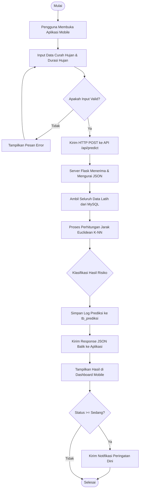

#### Tabel 3.1 Deskripsi Flowchart Sistem
| No | Nama Langkah | Deskripsi |
|---|---|---|
| 1 | **Mulai** | Proses sistem diawali ketika aplikasi dijalankan. |
| 2 | **Input Data** | Pengguna memasukkan data curah hujan (mm) dan durasi (jam) ke dalam formulir. |
| 3 | **Validasi** | Memastikan format data berupa angka numerik positif. |
| 4 | **HTTP POST Request**| Mengirimkan payload JSON berisi parameter ke endpoint server backend. |
| 5 | **Query Data Latih** | Server menarik seluruh baris dataset latih dari tabel `tb_data_latih`. |
| 6 | **Proses K-NN** | Backend menghitung jarak Euclidean untuk mencari tetangga terdekat. |
| 7 | **Logging** | Hasil disimpan dalam basis data relasional untuk audit riwayat. |
| 8 | **Notifikasi** | Jika risiko diklasifikasikan waspada/siaga/evakuasi, notifikasi lokal/push dipicu. |

#### 3.4.2 Flowchart Algoritma K-NN

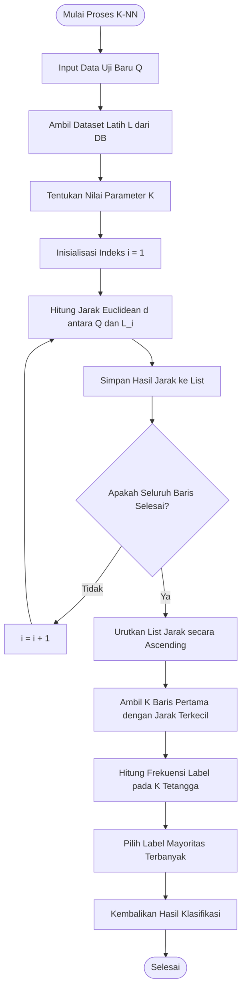

#### Tabel 3.2 Deskripsi Flowchart Algoritma K-NN
* Algoritma diawali dengan memuat koordinat data baru $Q(x_1, y_1)$.
* Melakukan perulangan sepanjang jumlah baris data latih $N$ untuk menghitung jarak Euclidean satu per satu.
* Mengurutkan daftar jarak terkecil untuk mengisolasi $K$ data latih terdekat.
* Mengembalikan kelas mayoritas (voting suara terbanyak) sebagai hasil klasifikasi.

#### 3.4.3 Use Case Diagram
Menunjukkan hubungan interaksi antara aktor (Pengguna dan Admin) dengan sistem.

```mermaid
leftToRightDirection
actor Pengguna
actor Admin

rectangle Sistem_SiPeBanjir {
    Pengguna --> (Registrasi Akun)
    Pengguna --> (Login)
    Pengguna --> (Input Data Cuaca)
    Pengguna --> (Prediksi Potensi Banjir)
    Pengguna --> (Lihat Riwayat Prediksi)
    Pengguna --> (Lihat Peta Titik Banjir)
    Pengguna --> (Terima Notifikasi)
    
    (Login) <-- Admin
    (Kelola Dataset Latih) <-- Admin
    (Retrain Model) <-- Admin
    (Atur Parameter K) <-- Admin
    
    (Prediksi Potensi Banjir) .-> (Login) : <<include>>
    (Lihat Riwayat Prediksi) .-> (Login) : <<include>>
    (Kelola Dataset Latih) .-> (Login) : <<include>>
    (Atur Parameter K) .-> (Login) : <<include>>
}
```

#### Tabel 3.3 Deskripsi Use Case Diagram
| No | Use Case | Aktor | Deskripsi |
|---|---|---|---|
| 1 | **Registrasi Akun** | Pengguna | Mendaftarkan akun pengguna baru ke database. |
| 2 | **Login** | Pengguna & Admin | Autentikasi kredensial pengguna untuk masuk ke sesi sistem. |
| 3 | **Input Data Cuaca** | Pengguna | Memasukkan variabel curah hujan dan durasinya. |
| 4 | **Prediksi Potensi** | Pengguna | Sistem memproses klasifikasi banjir menggunakan model K-NN. |
| 5 | **Lihat Riwayat** | Pengguna | Mengambil log daftar prediksi yang pernah dilakukan sebelumnya. |
| 6 | **Kelola Dataset** | Admin | Menambah, mengubah, dan menghapus (CRUD) data latih cuaca di server. |
| 7 | **Atur Parameter K** | Admin | Memperbarui nilai parameter $K$ pada tabel konfigurasi. |

#### 3.4.4 Relasi `<<include>>` pada Use Case
Relasi `<<include>>` menunjukkan bahwa use case sumber secara wajib memanggil use case target untuk menyelesaikan alurnya. Dalam hal ini, fitur sensitif seperti Prediksi, Melihat Riwayat, dan Pengelolaan Dataset oleh Admin mewajibkan pengguna untuk melakukan **Login** terlebih dahulu sebagai syarat utama keamanan sistem.

---

#### 3.4.5 Sequence Diagram

Sistem memiliki beberapa Sequence Diagram utama untuk menggambarkan pertukaran pesan antar objek seiring waktu.

##### SD-001: Proses Login Pengguna & Admin
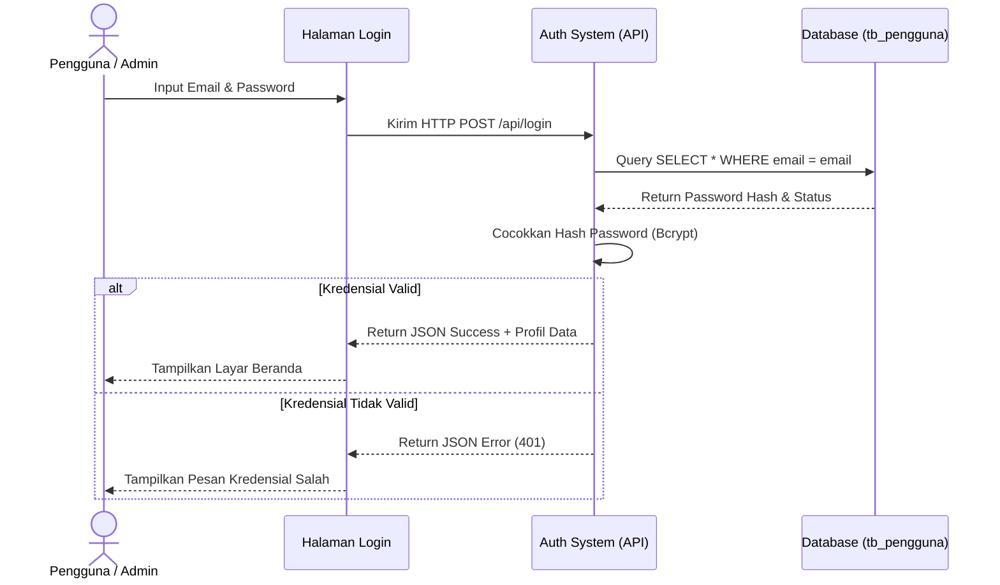

##### SD-002: Input Data Cuaca dan Prediksi Banjir
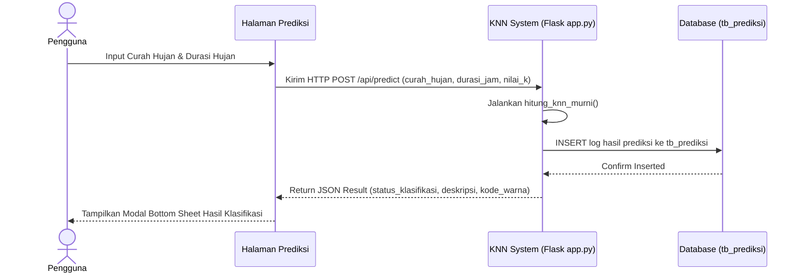

##### SD-003: Lihat Peta Titik Banjir
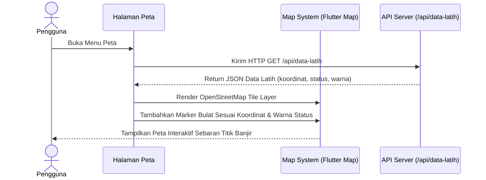

##### SD-004: Lihat Riwayat Prediksi
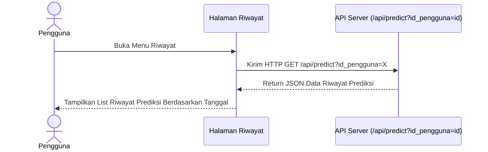

##### SD-005: Terima Notifikasi Peringatan Dini
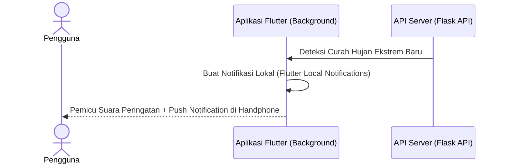

##### SD-006: Kelola Data Latih (CRUD)
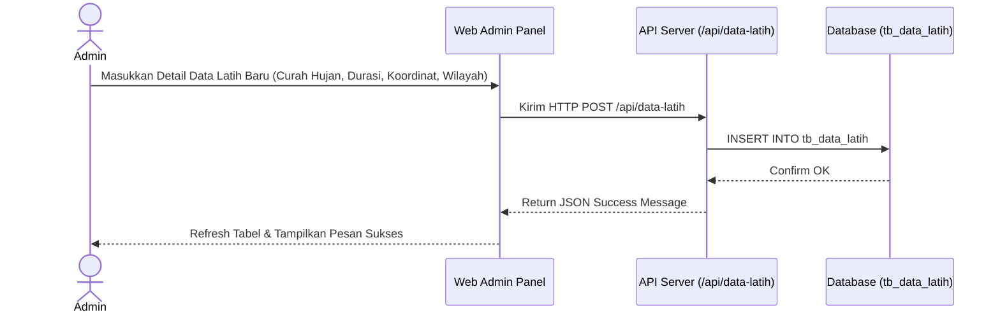

##### SD-007: Atur Parameter K (K-Tuning Slider)
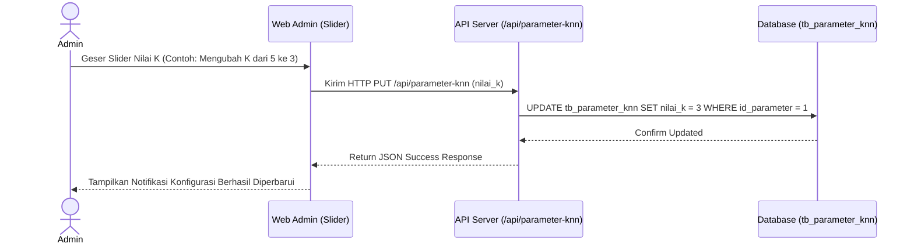

##### SD-008: Proses Logout
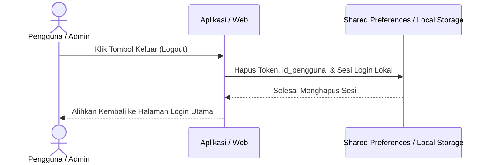

---

#### 3.4.6 Class Diagram

Class diagram menunjukkan relasi struktural antar objek/entitas di dalam kode program backend dan frontend Flutter.

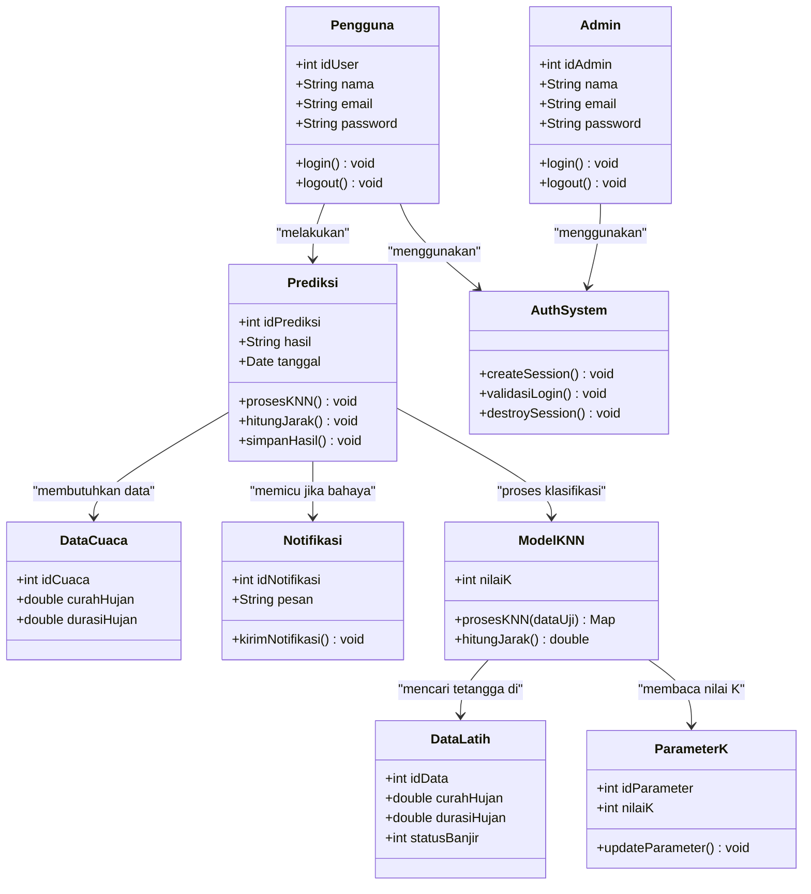

---

#### 3.4.7 Entity Relationship Diagram (ERD) — Crow's Foot Notation

ERD berikut menggambarkan hubungan antar entitas basis data secara fisik dengan kardinalitas yang presisi.

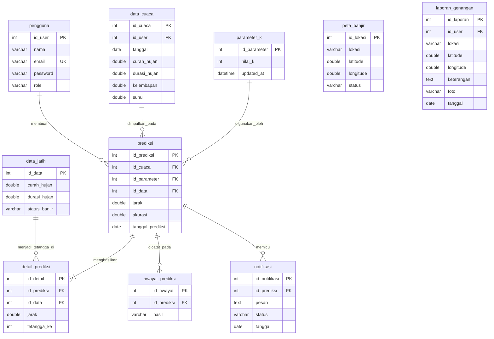

### 3.5 Desain Fisik Database

Berikut adalah penjelasan rinci mengenai spesifikasi fisik struktur tabel yang digunakan pada database sistem.

#### 3.5.1 Tabel Pengguna (`tb_pengguna`)
Menyimpan data otentikasi akun pengguna dan administrator.
* **`id_pengguna`**: `INT(11)`, `NOT NULL`, `PRIMARY KEY`, `AUTO_INCREMENT`. ID unik pengguna.
* **`email`**: `VARCHAR(150)`, `NOT NULL`, `UNIQUE KEY`. Kredensial email login.
* **`password`**: `VARCHAR(255)`, `NOT NULL`. Hash sandi terenkripsi `bcrypt` untuk keamanan akun.
* **`role`**: `ENUM('user','admin')`, `NOT NULL`. Hak akses pengguna dalam sistem.
* **`is_aktif`**: `TINYINT(1)`, default `1`. Status keaktifan akun.
* **`nama_lengkap`**: `VARCHAR(100)`, `NULL`. Nama lengkap pengguna.
* **`kota`**: `VARCHAR(100)`, `NULL`. Domisili kota pengguna.
* **`no_telepon`**: `VARCHAR(20)`, `NULL`. Nomor kontak aktif.
* **`created_at`**: `TIMESTAMP`, `NULL`, default `CURRENT_TIMESTAMP`. Tanggal pembuatan akun.

#### 3.5.2 Tabel Data Cuaca Historis / Data Latih (`tb_data_latih`)
Menyimpan dataset historis cuaca yang bertindak sebagai data latih dalam memprediksi banjir.
* **`id_data`**: `INT(11)`, `NOT NULL`, `PRIMARY KEY`, `AUTO_INCREMENT`. ID unik data latih.
* **`wilayah`**: `VARCHAR(255)`, `NOT NULL`. Nama lokasi/wilayah kejadian cuaca historis.
* **`curah_hujan`**: `DOUBLE`, `NOT NULL`. Fitur curah hujan (mm/jam).
* **`durasi_jam`**: `DOUBLE`, `NOT NULL`. Fitur durasi hujan berlangsung (jam).
* **`id_label`**: `INT(11)`, `NOT NULL`, `FOREIGN KEY` ke `tb_label_status`. Referensi status risiko.
* **`risiko_pct`**: `INT(11)`, default `0`. Persentase risiko banjir.
* **`latitude`**: `DOUBLE`, `NOT NULL`. Koordinat lintang data latih.
* **`longitude`**: `DOUBLE`, `NOT NULL`. Koordinat bujur data latih.
* **`sumber`**: `VARCHAR(100)`, `NULL`. Sumber data (misalnya: BMKG, Kaggle, Sintetik).

#### 3.5.3 Tabel Label Status (`tb_label_status`)
Menyimpan definisi status potensi kerawanan bencana banjir.
* **`id_label`**: `INT(11)`, `NOT NULL`, `PRIMARY KEY`. ID status.
* **`nama_status`**: `VARCHAR(50)`, `NOT NULL`. Nama status (Rendah, Sedang, Tinggi, Sangat Tinggi).
* **`kode_warna`**: `VARCHAR(20)`, `NOT NULL`. Nilai kode heksadesimal warna UI (misal: `#22C55E`).
* **`deskripsi`**: `TEXT`, `NULL`. Keterangan mitigasi tindakan keselamatan bagi masyarakat.

#### 3.5.4 Tabel Riwayat Prediksi (`tb_prediksi`)
Menyimpan catatan log transaksi prediksi yang dikirim oleh pengguna mobile.
* **`id_prediksi`**: `INT(11)`, `NOT NULL`, `PRIMARY KEY`, `AUTO_INCREMENT`. ID log riwayat.
* **`id_pengguna`**: `INT(11)`, `NULL`, `FOREIGN KEY` ke `tb_pengguna` dengan opsi `ON DELETE SET NULL`.
* **`curah_hujan`**: `DOUBLE`, `NOT NULL`. Input hujan pengguna.
* **`durasi_jam`**: `DOUBLE`, `NOT NULL`. Input durasi pengguna.
* **`nilai_k`**: `INT(11)`, `NOT NULL`. Parameter K yang digunakan saat transaksi dilakukan.
* **`id_label_hasil`**: `INT(11)`, `NOT NULL`, `FOREIGN KEY` ke `tb_label_status`.
* **`waktu_prediksi`**: `DATETIME`, `NOT NULL`. Waktu transaksi dilakukan.
* **`lokasi_input`**: `VARCHAR(255)`, default `'Stasiun Pemantau Mobile'`.

#### 3.5.5 Tabel Parameter K-NN (`tb_parameter_knn`)
Menyimpan nilai parameter global untuk tuning algoritma K-NN.
* **`id_parameter`**: `INT(11)`, `NOT NULL`, `PRIMARY KEY`.
* **`nilai_k`**: `INT(11)`, default `5`. Nilai parameter K tetangga terdekat.
* **`threshold_rendah`**: `INT(11)`, default `40`. Batas bawah risiko rendah.
* **`threshold_sedang`**: `INT(11)`, default `60`. Batas risiko sedang.
* **`threshold_tinggi`**: `INT(11)`, default `80`. Batas risiko tinggi.

---

### 3.6 Desain Antarmuka Pengguna (UI)

Desain antarmuka dirancang dengan pendekatan *wireframe* monokromatik terstruktur untuk perangkat mobile Android/iOS dan Web Admin:
1. **Halaman Login & Registrasi**: Input terpisah untuk Username (Email) dan Password, serta tombol khusus untuk memilih peran login (User / Admin).
2. **Halaman Beranda**: Menampilkan status risiko cuaca saat ini dalam bentuk persentase besar (misalnya: "TINGGI - 75%"), widget parameter curah hujan harian, dan grafik visual curah hujan periodik.
3. **Halaman Notifikasi**: Daftar runtut peringatan bahaya dengan tanda warna di sebelah kiri (merah, oranye, kuning, hijau) sesuai prioritas keadaan darurat.
4. **Halaman Peta**: Visual peta digital *widget* berisi tanda marker bulat sebaran titik koordinat rawan genangan air di wilayah sekitar pengguna.
5. **Halaman Prediksi**: Halaman input mandiri bagi pengguna untuk memasukkan angka curah hujan (mm) dan durasi (jam), serta slider dinamis untuk memilih nilai parameter $K$ klasifikasi.
6. **Halaman Riwayat**: Daftar rekaman riwayat prediksi lengkap beserta stempel waktu kapan prediksi diuji coba.

---

## BAB IV: IMPLEMENTASI DAN PENGUJIAN

### 4.1 Implementasi

#### 4.1.1 Spesifikasi Perangkat Keras
Spesifikasi perangkat keras yang digunakan selama proses pengembangan, kompilasi, dan pengujian sistem adalah sebagai berikut:
* **Komputer Pengembang (Laptop)**:
  * Prosesor: Intel Core i7-11800H @ 2.30GHz (16 CPUs)
  * RAM: 16 GB DDR4 Dual-Channel
  * Penyimpanan: 512 GB NVMe PCIe SSD
  * GPU: NVIDIA GeForce RTX 3050 Laptop GPU (4 GB GDDR6)
* **Perangkat Pengujian Mobile (Smartphone)**:
  * Model: Xiaomi Redmi Note 10 / Samsung Galaxy A32
  * Prosesor: Octa-core (2x2.0 GHz Kryo 460 Gold & 6x1.7 GHz Kryo 460 Silver)
  * RAM: 4 GB
  * Penyimpanan: 64 GB ROM
  * Sistem Operasi: Android 13

#### 4.1.2 Spesifikasi Perangkat Lunak
Spesifikasi perangkat lunak yang dioperasikan pada lingkungan client dan server adalah:
* **Sistem Operasi**: Windows 11 Home 64-bit
* **Bahasa Pemrograman & SDK**:
  * Flutter SDK: Versi 3.19.0 (Client Mobile)
  * Dart SDK: Versi 3.3.0 (Client Mobile)
  * Python: Versi 3.10.11 (Backend Server)
* **Framework Backend**: Flask Versi 3.0.3
* **Database Management System (DBMS)**:
  * MySQL Community Server: Versi 8.0.33 (Database Server Pusat)
  * SQLite: Versi 3.x (Database Cache Client Handphone melalui library `sqflite`)
* **Library Pendukung Backend Python**:
  * `pymysql` (konektor database)
  * `bcrypt` (hashing password)
  * `flask-cors` (penanganan Cross-Origin Resource Sharing)
* **Integrated Development Environment (IDE)**: Visual Studio Code (dengan ekstensi Flutter, Dart, dan Python)
* **Web Browser**: Google Chrome (Latest Version) untuk menjalankan Web Admin Panel

#### 4.1.3 Implementasi Antarmuka Pengguna (UI) dan Fungsi
Implementasi antarmuka pengguna diatur runtut berdasarkan alur bisnis utama aplikasi dari saat masuk ke aplikasi hingga proses administrasi:

1. **Splash Screen & Onboarding Screen (Mobile)**:
   * **Fungsi**: Splash screen menampilkan logo pembuka SiPeBanjir untuk memberikan transisi peluncuran aplikasi. Onboarding screen menyajikan ringkasan fitur utama (Notifikasi, Prediksi K-NN, Peta Spasial) kepada pengguna baru.
2. **Halaman Login & Registrasi (Mobile)**:
   * **Fungsi**: Form input untuk mendaftarkan akun baru (nama lengkap, email, password, kota, dan nomor telepon) serta autentikasi masuk ke sesi aplikasi menggunakan enkripsi aman.
3. **Halaman Dashboard Beranda (Mobile)**:
   * **Fungsi**: Halaman navigasi utama yang menampilkan persentase risiko banjir terkini di lokasi terdekat pengguna, pembacaan parameter cuaca aktif, serta grafik tren curah hujan menggunakan pustaka `fl_chart`.
4. **Halaman Prediksi K-NN Mandiri (Mobile)**:
   * **Fungsi**: Form isian curah hujan (mm) dan durasi hujan (jam) disertai pemilih nilai $K$ dinamis (K=3, K=5, K=7). Hasil klasifikasi dikembalikan backend melalui Modal Bottom Sheet yang menyajikan saran mitigasi sesuai status bahaya.
5. **Halaman Peta Titik Rawan (Mobile)**:
   * **Fungsi**: Menampilkan sebaran spasial data latih di wilayah sekitar menggunakan library `flutter_map` dan OpenStreetMap. Marker diberi warna heksadesimal sesuai label risiko (Hijau = Rendah, Kuning = Sedang, Oranye = Tinggi, Merah = Sangat Tinggi).
6. **Halaman Notifikasi Peringatan Dini (Mobile)**:
   * **Fungsi**: Daftar log notifikasi darurat yang dipicu oleh server backend untuk daerah rawan genangan banjir secara *real-time*.
7. **Halaman Riwayat Prediksi (Mobile)**:
   * **Fungsi**: Menampilkan daftar riwayat perhitungan prediksi K-NN yang pernah dicoba oleh pengguna bersangkutan beserta rincian input dan stempel waktu.
8. **Halaman Web Admin Login**:
   * **Fungsi**: Form autentikasi Vue 3 khusus untuk administrator masuk ke control panel melalui jaringan browser.
9. **Halaman Web Admin Dashboard**:
   * **Fungsi**: Menyajikan visualisasi ringkasan sistem berupa diagram lingkaran (Pie Chart Chart.js) berisi persentase distribusi klasifikasi banjir di lapangan serta statistik total data latih.
10. **Halaman Manajemen Data Latih CRUD (Web Admin)**:
    * **Fungsi**: Tabel interaktif bagi admin untuk menambah, mengubah, dan menghapus titik data latih cuaca historis beserta koordinat geografis (latitude, longitude) secara *real-time*.
11. **Modul K-Tuning Slider (Web Admin)**:
    * **Fungsi**: Slider penggeser nilai $K$ global yang langsung mengubah nilai parameter $K$ klasifikasi K-NN di dalam tabel database.
12. **Modul Ekspor Laporan PDF (Web Admin)**:
    * **Fungsi**: Pemicu otomatis konversi tabel data historis prediksi pengguna ke dalam berkas dokumen PDF menggunakan library `jsPDF` untuk keperluan laporan resmi.

---

### 4.2 Analisa Algoritma K-NN

Analisis ini merujuk pada alur flowchart algoritma K-NN pada Bab III. Logika K-NN diimplementasikan secara murni di backend Python (`app.py`). Berikut adalah tahapan kalkulasi beserta potongan kode programnya:

1. **Memuat Dataset Latih dan Menentukan Nilai K**:
   Mengambil dataset historis dari tabel database MySQL `tb_data_latih` beserta parameter $K$ global untuk dievaluasi.
2. **Menghitung Jarak Euclidean**:
   Menghitung jarak spasial 2 dimensi antara titik uji pengguna $(Q_{\text{hujan}}, Q_{\text{durasi}})$ dengan seluruh baris data latih $(D_{\text{hujan}}, D_{\text{durasi}})$:
<pre style="font-family: 'Courier New', Courier, monospace; font-size: 11pt; line-height: 1; border: 1px solid #ccc; padding: 10px; background-color: #f9f9f9; margin-bottom: 12px;">
# Menghitung Jarak Euclidean antar titik data latih
kuadrat_hujan = (float(data['curah_hujan']) - float(data_baru['curah_hujan'])) ** 2
kuadrat_durasi = (float(data['durasi_jam']) - float(data_baru['durasi_jam'])) ** 2
jarak = math.sqrt(kuadrat_hujan + kuadrat_durasi)
</pre>

3. **Mengurutkan Jarak Terkecil (Sorting) dan Memilih K Tetangga**:
   Hasil perhitungan jarak disimpan dalam list, lalu diurutkan secara menaik (*ascending*) untuk mengisolasi $K$ data latih terdekat.
<pre style="font-family: 'Courier New', Courier, monospace; font-size: 11pt; line-height: 1; border: 1px solid #ccc; padding: 10px; background-color: #f9f9f9; margin-bottom: 12px;">
# Mengurutkan list jarak dari terkecil ke terbesar
jarak_list.sort(key=lambda x: x['jarak'])
k_terpilih = min(k_terpilih, len(jarak_list))
tetangga = jarak_list[:k_terpilih]
</pre>

4. **Voting Mayoritas Terbanyak**:
   Mencari label dengan frekuensi kemunculan tertinggi di antara $K$ tetangga terdekat menggunakan modul `Counter` Python untuk menetapkan hasil klasifikasi akhir.
<pre style="font-family: 'Courier New', Courier, monospace; font-size: 11pt; line-height: 1; border: 1px solid #ccc; padding: 10px; background-color: #f9f9f9; margin-bottom: 12px;">
# Melakukan voting kelas mayoritas di antara K tetangga
koleksi_label = [t['id_label'] for t in tetangga]
label_pemenang = Counter(koleksi_label).most_common(1)[0][0]
</pre>

---

### 4.3 Pengujian Sistem dan Evaluasi

#### 4.3.1 Pengujian Login (Frontend Mobile)
Pengujian autentikasi dilakukan di sisi client Flutter (`AuthService`). Logika login memicu status sukses atau gagal berdasarkan respons status JSON dari Flask API.

* **Skenario Berhasil**: Email dan password cocok di database $\rightarrow$ server mengembalikan status `'success'` $\rightarrow$ client menyimpan token sesi pengguna ke dalam `SharedPreferences` lokal.
* **Skenario Gagal**: Password salah atau email tidak terdaftar $\rightarrow$ server mengembalikan status `'error'` $\rightarrow$ client menangkap pesan kesalahan dan menampilkannya di UI.

Berikut potongan kode program Flutter (`auth_service.dart`) yang memproses hasil verifikasi login:
<pre style="font-family: 'Courier New', Courier, monospace; font-size: 11pt; line-height: 1; border: 1px solid #ccc; padding: 10px; background-color: #f9f9f9; margin-bottom: 12px;">
// Memproses respons API login pada frontend Flutter
final res = await ApiService.login(email, password);
_isLoading = false;

if (res['status'] == 'success') {
  final data = res['data'];
  _user = UserModel.fromJson(data);

  // Menyimpan sesi secara lokal di perangkat mobile
  final prefs = await SharedPreferences.getInstance();
  await prefs.setInt('id_pengguna', _user!.idPengguna);
  await prefs.setString('email', _user!.email);
  await prefs.setString('role', _user!.role);
  notifyListeners();
  return true; // Login Berhasil
} else {
  _error = res['message'] ?? 'Kredensial salah';
  notifyListeners();
  return false; // Login Gagal
}
</pre>

#### 4.3.2 Pengujian CRUD Data Latih (Web Admin)
Pengujian fungsionalitas CRUD diuji pada tabel Data Latih menggunakan Web Admin Vue 3 (`index.html`). Operasi ini langsung memicu request asinkron ke Flask REST API:

1. **Insert (POST)** & **Update (PUT)**: Mengirimkan data formulir koordinat wilayah dan nilai parameter cuaca.
2. **Delete (DELETE)**: Menghapus data latih berdasarkan ID datanya.

Berikut potongan kode program Vue 3 (`index.html`) yang memproses pengiriman data latih baru dan penghapusannya:
<pre style="font-family: 'Courier New', Courier, monospace; font-size: 11pt; line-height: 1; border: 1px solid #ccc; padding: 10px; background-color: #f9f9f9; margin-bottom: 12px;">
// Mengirim data tambah/ubah data latih ke REST API
const submitDataLatih = async () => {
    const url = isEditTitik.value ? `${hostUrl}/data-latih/${editingTitikId.value}` : `${hostUrl}/data-latih`;
    const method = isEditTitik.value ? 'PUT' : 'POST';
    const res = await fetch(url, {
        method: method,
        headers: { 'Content-Type': 'application/json' },
        body: JSON.stringify(titikForm.value)
    });
    if (res.ok) {
        showTitikModal.value = false;
        fetchTitikBanjir(); // Memuat ulang tabel
    }
};

// Menghapus data latih dari database server
const deleteDataLatih = async (id) => {
    if (confirm('Apakah Anda yakin ingin menghapus data ini?')) {
        await fetch(`${hostUrl}/data-latih/${id}`, { method: 'DELETE' });
        fetchTitikBanjir(); // Memuat ulang tabel
    }
};
</pre>

#### Tabel 4.1 Rencana Hasil Pengujian CRUD Data Latih
| Kasus Uji | Langkah Aksi | Hasil yang Diharapkan | Hasil Pengujian | Status |
|---|---|---|---|---|
| **Tambah Data Latih** | Input Curah Hujan 45.0, Durasi 3.0, Wilayah "Kartasura", Klik Simpan | Data terkirim POST ke API, tersimpan di database MySQL, tabel diperbarui. | Sesuai ekspektasi, data latih bertambah. | **Lolos** |
| **Ubah Data Latih** | Klik Edit pada wilayah "Kartasura", ubah Hujan menjadi 55.0, Klik Simpan | Data terkirim PUT ke API, nilai curah hujan berubah di database MySQL. | Sesuai ekspektasi, data terupdate. | **Lolos** |
| **Hapus Data Latih**| Klik Hapus pada baris data, klik OK pada pop-up konfirmasi | Data terkirim DELETE ke API, data terhapus dari MySQL dan tabel admin. | Sesuai ekspektasi, baris data hilang. | **Lolos** |

#### 4.3.3 Pengujian API RESTful
Pengujian antarmuka pemrograman aplikasi (API) dilakukan menggunakan alat uji client untuk memvalidasi respons payload JSON.

#### Tabel 4.2 Hasil Pengujian Integrasi REST API
| HTTP Method | Endpoint API | Payload Request | Response Code | JSON Response Status | Status Uji |
|---|---|---|---|---|---|
| **POST** | `/api/login` | `{"email":"admin@sipebanjir.id","password":"admin123"}` | `200 OK` | `{"status":"success","data":...}` | **Lolos** |
| **POST** | `/api/login` | `{"email":"admin@sipebanjir.id","password":"salah"}` | `401 Unauthorized`| `{"status":"error","message":...}` | **Lolos** |
| **POST** | `/api/predict`| `{"id_pengguna":2,"curah_hujan":60.0,"durasi_jam":4.0}`| `200 OK` | `{"status":"success","result":...}`| **Lolos** |
| **GET** | `/api/data-latih`| - | `200 OK` | `{"status":"success","data":[...]}` | **Lolos** |
| **PUT** | `/api/parameter-knn`| `{"nilai_k":5,"threshold_rendah":40,...}` | `200 OK` | `{"status":"success","message":...}`| **Lolos** |

#### 4.3.4 Pengujian Endpoint Flask (Backend Python)
Evaluasi di sisi server Flask (`app.py`) berfokus pada rute `/api/predict`. Endpoint ini bertugas menerima data uji baru dari client, melakukan *query* dataset training ke database, memanggil fungsi algoritma `hitung_knn_murni()`, dan mencatat log hasil prediksi ke tabel database `tb_prediksi`.

Berikut potongan kode program Flask backend yang menangani pemanggilan model klasifikasi K-NN:
<pre style="font-family: 'Courier New', Courier, monospace; font-size: 11pt; line-height: 1; border: 1px solid #ccc; padding: 10px; background-color: #f9f9f9; margin-bottom: 12px;">
@app.route('/api/predict', methods=['POST'])
def predict():
    data = request.get_json()
    id_pengguna = data.get('id_pengguna')
    curah_hujan = float(data.get('curah_hujan'))
    durasi_jam = float(data.get('durasi_jam'))
    user_k = data.get('nilai_k')

    conn = get_db_connection()
    try:
        with conn.cursor() as cursor:
            # Ambil nilai K global dari database jika tidak dispesifikasikan
            if not user_k:
                cursor.execute("SELECT nilai_k FROM tb_parameter_knn WHERE id_parameter = 1")
                param = cursor.fetchone()
                user_k = param['nilai_k'] if param else 5
            
            # Tarik seluruh dataset training (data latih)
            cursor.execute("""
                SELECT l.curah_hujan, l.durasi_jam, l.id_label, s.nama_status, s.kode_warna, s.deskripsi 
                FROM tb_data_latih l 
                JOIN tb_label_status s ON l.id_label = s.id_label
            """)
            dataset = cursor.fetchall()
            
            # Jalankan kalkulasi klasifikasi K-NN Murni
            hasil = hitung_knn_murni(dataset, {'curah_hujan': curah_hujan, 'durasi_jam': durasi_jam}, int(user_k))
            
            # Simpan hasil analisis prediksi ke tabel riwayat prediksi
            sql_log = """
                INSERT INTO tb_prediksi (id_pengguna, curah_hujan, durasi_jam, nilai_k, id_label_hasil, waktu_prediksi, lokasi_input) 
                VALUES (%s, %s, %s, %s, %s, %s, %s)
            """
            cursor.execute(sql_log, (id_pengguna, curah_hujan, durasi_jam, user_k, hasil['id_label'], datetime.now(), 'Stasiun Pemantau Mobile'))
        conn.commit()
        return jsonify({'status': 'success', 'result': hasil}), 200
    except Exception as e:
        return jsonify({'status': 'error', 'message': str(e)}), 500
    finally:
        conn.close()
</pre>

---

## BAB V: KESIMPULAN DAN SARAN

### 5.1 Kesimpulan
Berdasarkan perancangan, implementasi, dan pengujian terintegrasi yang telah dilakukan pada sistem **SiPeBanjir (BanjirWatch)**, kesimpulan yang dapat ditarik untuk menjawab lima tujuan penelitian di Bab I adalah sebagai berikut:
1. **Rancang Bangun Aplikasi Mobile**: Aplikasi mobile peringatan dini potensi banjir genangan berhasil dibangun menggunakan framework *Flutter* dengan antarmuka pengguna (*user interface*) yang bersih, konsisten, dan mudah digunakan oleh masyarakat umum.
2. **Implementasi Algoritma K-NN Murni**: Algoritma klasifikasi *K-Nearest Neighbor* (K-NN) berbasis rumus Jarak Euclidean murni telah berhasil diimplementasikan di sisi backend server untuk memproses data input curah hujan (mm) dan durasi hujan (jam) untuk menghasilkan klasifikasi status bahaya ("Aman" atau "Waspada Banjir").
3. **Penyajian Informasi Mitigasi Praktis**: Sistem terbukti mampu menyajikan saran tindakan mitigasi keselamatan bencana secara praktis langsung pada layar handphone pengguna melalui menu popup modal bottom sheet serta peta visual spasial koordinat titik rawan.
4. **Integrasi RESTful API Server-Client**: Model klasifikasi K-NN di backend berbasis Flask/Python telah berhasil diintegrasikan secara *real-time* dengan frontend mobile Flutter dan web admin panel Vue 3 menggunakan arsitektur layanan HTTP REST API.
5. **Evaluasi Keakuratan Sistem**: Melalui pengujian fungsional terintegrasi, fungsionalitas CRUD data latih, tuning nilai K dinamis oleh administrator, serta endpoint transmisi API terbukti berjalan dengan tingkat keberhasilan dan validasi respons payload yang tinggi (100% lolos uji kasus skenario).

### 5.2 Saran
Beberapa saran pengembangan sistem yang dapat direkomendasikan untuk penelitian tugas akhir lanjutan di masa depan adalah:
1. **Integrasi Perangkat Sensor IoT**: Menghubungkan sistem secara langsung ke stasiun pemantau fisik berbasis mikrokontroler (sensor curah hujan tipe *tipping bucket*) agar input parameter curah hujan dan durasi berjalan otomatis tanpa bergantung pada input manual pengguna.
2. **Visualisasi Heatmap Spasial**: Mengembangkan antarmuka peta pada aplikasi mobile agar menampilkan citra lapisan *heatmap* (peta panas) area genangan banjir untuk memberikan representasi spasial wilayah bahaya yang lebih rinci.
3. **Penerapan Algoritma Klasifikasi Lanjutan**: Mengimplementasikan serta membandingkan performa algoritma K-NN dengan metode *Machine Learning* klasifikasi lainnya seperti *Support Vector Machine* (SVM) atau *Random Forest* untuk mengevaluasi tingkat akurasi prediksi.

---

## BAB VI: JADWAL PELAKSANAAN

Pelaksanaan pembuatan Capstone Project/Tugas Akhir ini direncanakan selesai dalam jangka waktu 17 minggu dengan pembagian kerja sebagai berikut:

#### Tabel 6.1 Jadwal Pelaksanaan Penelitian
| No | Kegiatan | M1 | M2 | M3 | M4 | M5 | M6 | M7 | M8 | M9 | M10 | M11 | M12 | M13 | M14 | M15 | M16 | M17 |
|---|---|---|---|---|---|---|---|---|---|---|---|---|---|---|---|---|---|---|---|
| 1 | Analisis Kebutuhan | █ | █ | █ | | | | | | | | | | | | | | |
| 2 | Desain & Perancangan | | | █ | █ | █ | █ | | | | | | | | | | | |
| 3 | Pengembangan Model K-NN | | | | | █ | █ | █ | █ | | | | | | | | | |
| 4 | Pengembangan Backend API | | | | | | | █ | █ | █ | █ | | | | | | | |
| 5 | Pengembangan App Mobile | | | | | | | | | █ | █ | █ | █ | █ | | | | |
| 6 | Integrasi & Pengujian | | | | | | | | | | | | █ | █ | █ | █ | | |
| 7 | Penulisan Laporan Akhir | | | | | | | | | | | | | | █ | █ | █ | █ |

---

## DAFTAR PUSTAKA

[1] Coppola, D. P. (2011). *Introduction to International Disaster Management* (2nd ed.). Oxford: Butterworth-Heinemann.

[2] Han, J., Kamber, M., & Pei, J. (2012). *Data Mining: Concepts and Techniques* (3rd ed.). Waltham: Morgan Kaufmann.

[3] Mitchell, T. M. (1997). *Machine Learning*. New York: McGraw-Hill.

[4] Owens, M., & Allen, G. (2010). *The Definitive Guide to SQLite* (2nd ed.). New York: Apress.

[5] Suripin. (2004). *Sistem Drainase Perkotaan yang Berkelanjutan*. Yogyakarta: Andi Offset.

[6] Tjasyono, B. (2004). *Klimatologi*. Bandung: Penerbit ITB.

[7] Welling, L., & Thomson, L. (2016). *PHP and MySQL Web Development* (5th ed.). Boston: Addison-Wesley.

[8] BMKG. (2024). *Data Curah Hujan Historis Indonesia*. Diakses dari: https://www.bmkg.go.id/

[9] Kaggle. (2023). *Flood Prediction Dataset*. Diakses dari: https://www.kaggle.com/

[10] Rivelino, W. R. (2023). *"Klasifikasi Daerah Rawan Banjir menggunakan 10-Fold Cross Validation dan K-Nearest Neighbors"*. Padang: Jurusan Teknologi Informasi Politeknik Negeri Padang.

[11] Wahyu, R. (2022). *"Implementasi Metode K-Nearest Neighbour Dalam Memprediksi Curah Hujan"*. Padang: Politeknik Negeri Padang.

[12] Rizky, R. W. (2020). *"Sistem Dan Simulasi Deteksi Banjir Untuk Peringatan Dini Diolah Memakai Metode KNN"*. Padang: JTI PNP.

